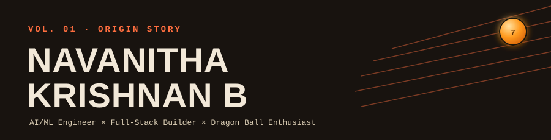
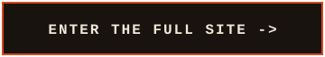
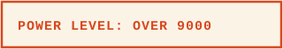
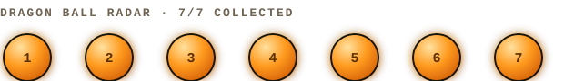
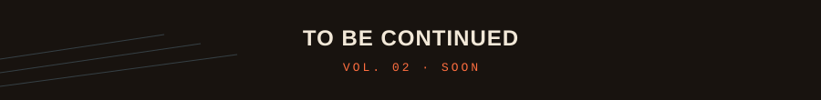

<p align="center">

</p>

<p align="center">

</p>

<p align="center">
<a href="https://navanithakrishnanb4-pixel.github.io/navanithakrishnanb4-pixel/">

</a>
</p>

---

## 🐉 About Me

```yaml
Name: Navanitha Krishnan B

Education:
   - B.E Artificial Intelligence & Machine Learning
   - Final-year student @ KGiSL Institute of Technology

Current Focus:
   - AI / Machine Learning
   - Full Stack Development
   - Data Structures & Algorithms

Flagship Project:
   - Nexonic Anime — my company. A future animation studio
     that will eventually ship its own IDE.

Fun Fact:
   - Anime + Coding + Coffee = Productivity ☕
```

---

## 🚀 Mission Log

**Flagship — my company:**

<p align="left">
<a href="https://github.com/navanithakrishnanb4-pixel/nexonic.anime">

</a>
</p>

Animation studio in the making — will eventually ship its own IDE.
📋 [Application form](https://docs.google.com/forms/d/1treil56VWFgkyw7EaUZ7m8ZcICRQjnWdxesnCTcP5Qw) · 📸 [@nexonic.anime](https://www.instagram.com/nexonic.anime) · 🌐 Company site — launching soon

**Practice arcs — smaller builds for learning:**

| Project | What it is |
|---|---|
| [OOHHII](https://github.com/navanithakrishnanb4-pixel/OOHHII) | Occupational health (OHI) & worker health platform |
| [Nexus AI](https://github.com/navanithakrishnanb4-pixel/nexus-ai) | AI router — sample mini project |
| [VibeForge](https://github.com/navanithakrishnanb4-pixel/vibeforge) | Full-stack, AI-powered code generator for ML pipelines, embedded systems & robotics |

---

## ⚡ Tech Arsenal

<p align="center">

</p>

---

## 📊 GitHub Statistics

<p align="center">


</p>

<p align="center">

</p>

<p align="center">

</p>

---

## 🐉 Fandom Shelf

<p align="center">

</p>

<p align="center">

</p>

The training-arc mindset — small reps, steady grind, occasional transformation — is basically how I approach every new skill.

<p align="center">


</p>

---

## 🌐 Send Signal

<p align="center">
<a href="mailto:navanithakrishnanb4@gmail.com">

</a>
<a href="https://linkedin.com/in/navanitha-krishnan-329b77377">

</a>
<a href="https://github.com/navanithakrishnanb4-pixel">

</a>
<a href="https://www.kaggle.com/navanithakrishnanb">

</a>
<a href="https://www.instagram.com/navito._.kun">

</a>
</p>

---

## 👀 Visitors

<p align="center">

</p>

<p align="center">

</p>
