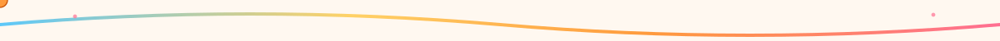

 

  

## 🌤️ A little about me

I'm a final-year AI/ML student who likes turning messy real-world signals —
photos, sensor readings, whatever's on hand — into something a computer can
actually reason about. I enjoy the stretch between "this is just data" and
"this is a working system," and I usually end up spending way too long on
the small details that make a project feel finished.

## 🧰 What I build with

<table align="center">
<tr>
<td valign="top" width="33%">

**Modeling**
- Computer vision (OpenCV, YOLOv8)
- Model training & evaluation
- Applied ML pipelines

</td>
<td valign="top" width="33%">

**Systems**
- Flask + React
- MySQL, Docker
- REST APIs, JWT auth

</td>
<td valign="top" width="33%">

**Tooling**
- Git & GitHub
- Automated reporting (ReportLab)
- Linux dev environments

</td>
</tr>
</table>

## 🌈 Something I've built

<b>🏗️ Construction Site Progress Monitor</b>

 

A full-stack system that compares site photos against blueprints to track
construction progress automatically — my final-year engineering project.

| | |
|---|---|
| **Computer vision** | OpenCV (SSIM image comparison), YOLOv8 object detection |
| **Stack** | Flask, React, MySQL, Docker, JWT auth |
| **Reporting** | Automated PDF generation with ReportLab |
| **Design** | Custom "blueprint" dark-navy frontend system |
| **Status** | ✅ Complete |

## 📊 GitHub, by the numbers

 

## 🐍 What I've been up to

<!-- switch on once the Snake Action workflow has run once on your repo -->

## 💌 Say hi

